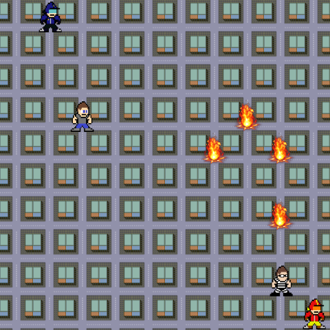

# AOSE - Agent-Oriented Software Engineering

This is my final project for the [AOSE](https://en.wikipedia.org/wiki/Agent-oriented_software_engineering) class. It's a simulation involving a criminal, a civilian, a fire fighter and a police officer.

You can watch the simulation [here](https://victorribeiro.com/esoa)

## Rules of the simulation

### The Criminal 
* Moves randomly across the board in any four directions: up, down, left and right.
* Has a 1/6 chances of starting a fire.
* Can get trapped in his own fire.
* Can walk in the Police Officer and get arrested.

### The Civilian
* Moves from top to bottom, left to right. When he reaches the bottom, he goes back to the top.
* If he sees a fire he stops and calls the Firefighter.
* If he sees the criminal, he calls the Police Officer informing the position he saw him.

### The Firefighter
* Stays still until called about a fire.
* When called, move to the position where the fire was spoted.
* If he passes another fire in the way, he puts it out.
* If he sees the Criminal, he calls the Police Officer informing the position he saw him.

### The Police Officer
* Stays still until called about the Criminal.
* When called, he moves to the position the criminal was last seen.
* If he sees a fire he stop and calls the Firefighter.
* If he sees the criminal he arrestes him.

The simulation is over when the criminal gets arrested.
